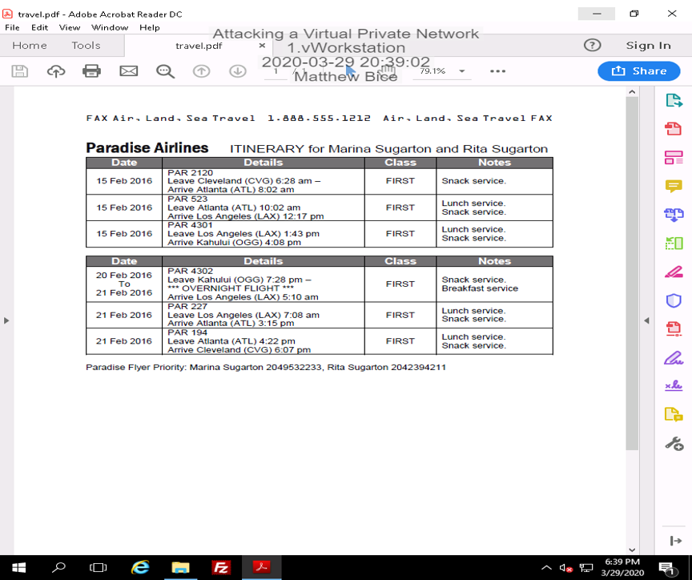
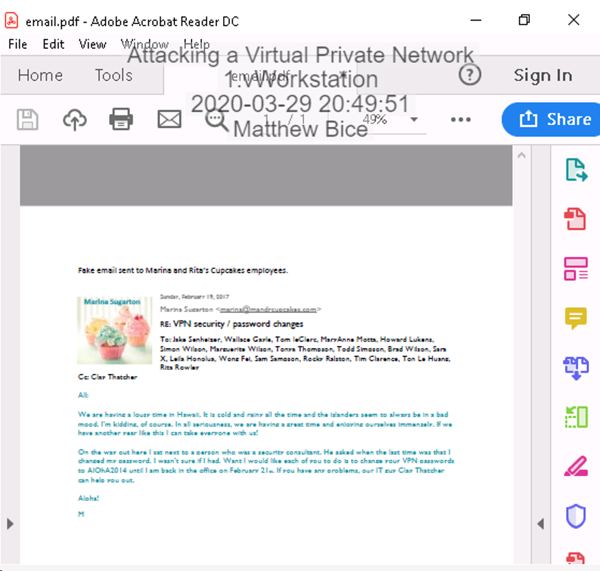
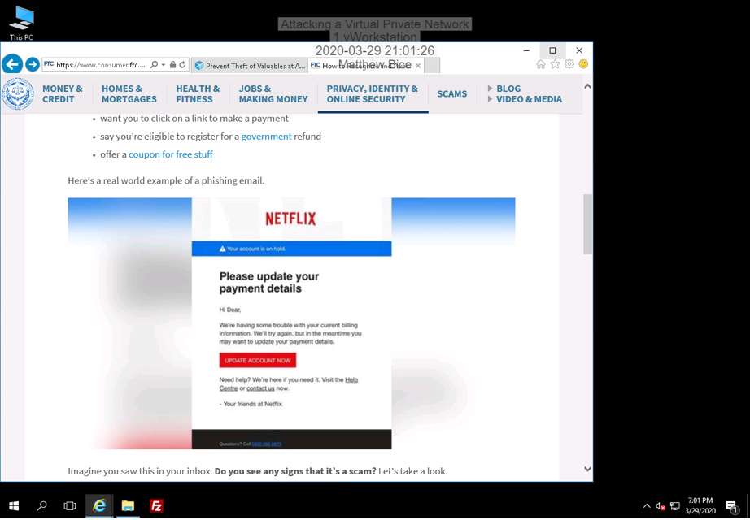

# Introduction

This lab will demonstrate the effects of social engineering and how it can be used to compromise the security of virtual private networks (VPNs). In the first scenario, I have hired a hacker who will assist me in launching a phishing campaign against a company called "Marina and Rita's Cupcakes". From there, I will discuss some possible countermeasures for social engineering and demonstrate a Man-in-the-Middle attack.

# Hands-On Demonstration

## Social Engineering / Reverse Social Engineering Attack

### Access travel itinerary for Marina and Rita

In this step, I have been arranged for my hired hacker to access information about my competitor Marina and Rita’s Cupcakes. He or she has found out that they are going on a business trip and my hacker accesses their travel itinerary. Below is a screenshot of this.

<p align="center">
  
</p>

### Sending a fake email prompting the key people in Marina and Rita's company to change their VPN passwords

Not satisfied with the information was given, I have my hacker send out an email spoofing Marina’s identity that prompts the key people in her company to change their VPN password to one that me and the hacker already know. By doing so, I will have access to all of these people’s emails as well. The screenshot below shows this email.

<p align="center">
  
</p>

## Spear Phishing Email Attack

### Screen capture of favorite scam email

This step shows a screenshot of my favorite scam email from this lab. It’s the first one shown, but I especially love it because of how blatantly fake it is (“Hi Dear” really got me).

<p align="center">
  
</p>

### Drafting my very own phishing email

* * *

|:-------------|:------------------|:------|
| To:          | Charlie Roberts <croberts@beingattacked.com>  |
| From: | Susan Dougherty <susand@innocentbystander.com>       |
| Date:           | Sunday, March 29, 2020                     |
| Subject:           | A favor?                                |


## Header 2

> This is a blockquote following a header.
>
> When something is important enough, you do it even if the odds are not in your favor.


###### Header 6

| head1        | head two          | three |
|:-------------|:------------------|:------|
| ok           | good swedish fish | nice  |
| out of stock | good and plenty   | nice  |
| ok           | good `oreos`      | hmm   |
| ok           | good `zoute` drop | yumm  |

### There's a horizontal rule below this.

* * *

### Here is an unordered list:

*   Item foo
*   Item bar
*   Item baz
*   Item zip

### And an ordered list:

1.  Item one
1.  Item two
1.  Item three
1.  Item four

### And a nested list:

- level 1 item
  - level 2 item
  - level 2 item
    - level 3 item
    - level 3 item
- level 1 item
  - level 2 item
  - level 2 item
  - level 2 item
- level 1 item
  - level 2 item
  - level 2 item
- level 1 item

### Small image


### Large image


### Definition lists can be used with HTML syntax.

<dl>
<dt>Name</dt>
<dd>Godzilla</dd>
<dt>Born</dt>
<dd>1952</dd>
<dt>Birthplace</dt>
<dd>Japan</dd>
<dt>Color</dt>
<dd>Green</dd>
</dl>

```
Long, single-line code blocks should not wrap. They should horizontally scroll if they are too long. This line should be long enough to demonstrate this.
```

```
The final element.
```
