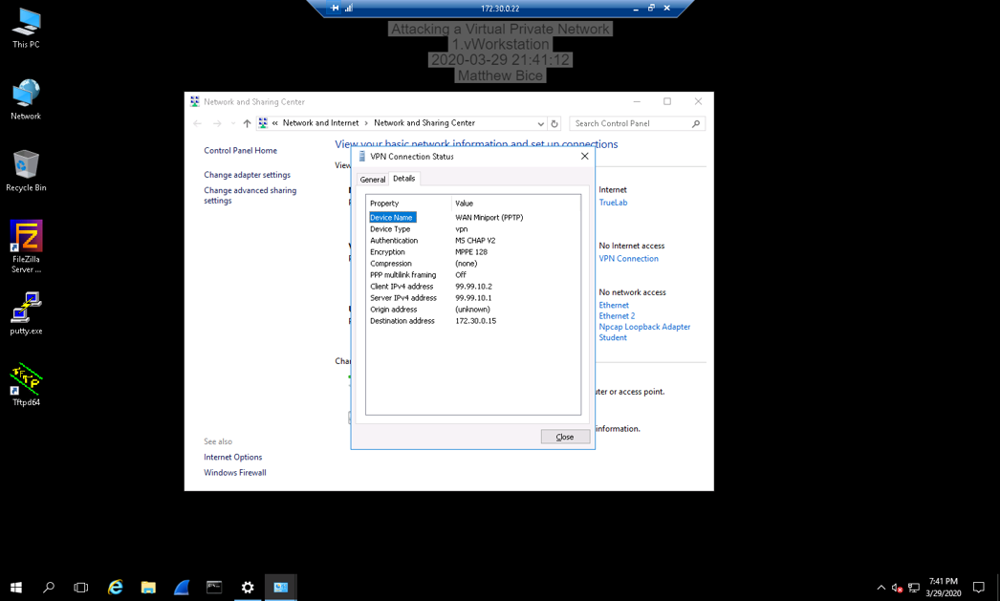
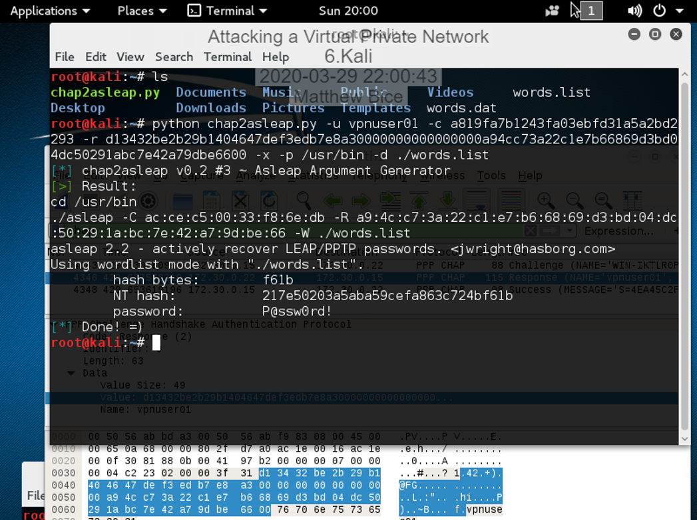

# Introduction

This lab will demonstrate the effects of social engineering and how it can be used to compromise the security of virtual private networks (VPNs). In the first scenario, I have hired a hacker who will assist me in launching a phishing campaign against a company called "Marina and Rita's Cupcakes". From there, I will discuss some possible countermeasures for social engineering and demonstrate a Man-in-the-Middle attack.

# Hands-On Demonstration

## Social Engineering / Reverse Social Engineering Attack

### Access travel itinerary for Marina and Rita

In this step, I have been arranged for my hired hacker to access information about my competitor Marina and Rita’s Cupcakes. He or she has found out that they are going on a business trip and my hacker accesses their travel itinerary. Below is a screenshot of this.

  

### Sending a fake email prompting the key people in Marina and Rita's company to change their VPN passwords

Not satisfied with the information was given, I have my hacker send out an email spoofing Marina’s identity that prompts the key people in her company to change their VPN password to one that me and the hacker already know. By doing so, I will have access to all of these people’s emails as well. The screenshot below shows this email.

  

## Spear Phishing Email Attack

### Screen capture of favorite scam email

This step shows a screenshot of my favorite scam email from this lab. It’s the first one shown, but I especially love it because of how blatantly fake it is (“Hi Dear” really got me).

  

### Drafting my very own phishing email

* * *
To:       Charlie Roberts <croberts@beingattacked.com>

From:     Susan Dougherty <susand@innocentbystander.com>   

Date:     Sunday, March 29, 2020     

Subject:  A favor?                               

>Hello Robert,
I hope this message finds you well. I regret to inform you that at the moment, we are terribly far from reaching our donation goals for the year. Due to the circumstances this year, our afflicted children have never been in greater need of treatment and care. That is why I am writing to you today. I am reaching out to the CSCDS staff and asking for any donations in order to help our situation.
>
>Click here (this is where the fake link is) to go to our donations page. From there, you will be asked to select the amount you wish to donate and enter your payment information. As you know, our servers are verified, and any transformation of information is totally secure.
Thank you for your time and please remember that any amount helps!
Your truly,
>	Susan Dougherty

# Applied Learning

## On-Path (Man-in-the-Middle) Attack

### Screen capture of VPN IP address

This step shows that the victim’s computer is connected to the legitimate VPN. In doing so, the Wireshark running on the hacker’s machine can capture the victim’s internet traffic.

  

### Acquire the victim's password

Now that the victim is connected to the VPN (and disconnected), the Wireshark running on the hacker’s computer can capture the transaction that took place as the user was connecting to the VPN. By using the program chaps2sleap.py, a wordlist file is used to crack the VPN’s password.  The screenshot below shows the result of this including the VPN’s password.

  

# Lab Challenge and Analysis

## Analysis and Discussion

Personally, I believe there is no better way to get information from someone than social engineering. Computers are made to be infallible machines with tight security and seamless data transfers. A human is not. Humans have flaws and innate psychological responses that can be exploited. Among these are people’s desires to be nice, helpful, sympathetic, and trusting. Moreover, unlike computers, humans have emotions that can cloud their judgement. Far too often, phishing emails, especially aimed at the right person, can get the job done. 

Of course, if you cannot get the information of your target, the next best thing would be to buy that information off a professional hacker or data miner. This would be easier in terms of workload for the attacker, but this may end up being very expensive. You would also have to expose your machine to the dark web which can lead to all sorts of trouble.

Finally, I think the third best way to access VPN information would be to use the man-in-the-middle attack. The process seems straightforward although the only trouble would be to acquire your victim’s IP address. The difficulty of this can vary greatly.

## Tools and Commands

From the Wireshark capture, the IP of the VPN server is 172.30.0.15 and the IP of the VPN client is 172.30.0.22.
